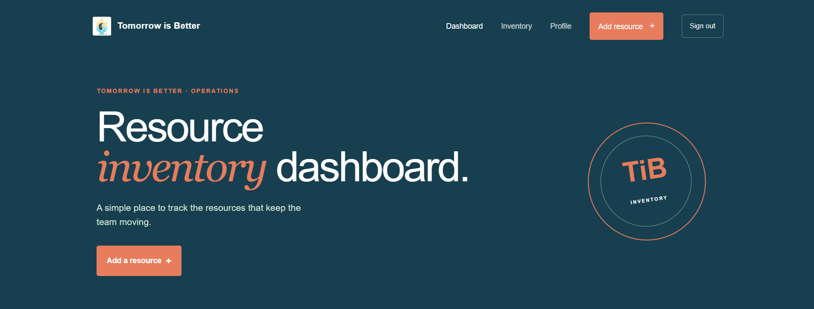

# TiB Inventory System

TiB Inventory System is a MERN inventory management website for tracking team resources. Users can create an account, sign in, view inventory, add products, update product details, and delete products. Authenticated users can also manage their profile, while administrators can manage user roles.



## Features

- User registration and login with JWT authentication
- Dashboard with inventory summaries
- Create, read, update, and delete inventory products
- Product ownership and role-based access control
- Profile and user-role management for administrators
- Responsive React interface

## Tech Stack

- **Frontend:** React, React Router, Fetch API
- **Backend:** Node.js, Express, JWT, bcrypt
- **Database:** MongoDB with Mongoose

## Project Structure

```text
Backend/     Express API and MongoDB models
Frontend/    React client application
```

## Local Setup

### 1. Install dependencies

From the project root:

```bash
cd Backend
npm install

cd ../Frontend
npm install
```

### 2. Configure MongoDB

Create `Backend/atlas-credentials.env` with your MongoDB connection string:

```env
MONGODB_URI=mongodb://127.0.0.1:27017/IMS
```

The credentials file is ignored by Git. MongoDB Atlas users can replace the local connection string with their Atlas URI.

### 3. Start the backend

In one terminal:

```bash
cd Backend
npm run server
```

The API runs at `http://localhost:3001`.

### 4. Start the frontend

In a second terminal:

```bash
cd Frontend
npm start
```

The React app opens at `http://localhost:3000`.

## Production Build

To create an optimized frontend build:

```bash
cd Frontend
npm run build
```

The frontend currently calls the API at `http://localhost:3001`. For production hosting, update `Frontend/src/api.js` to use the deployed backend URL before building.

## License

This project is provided for learning and demonstration purposes.
